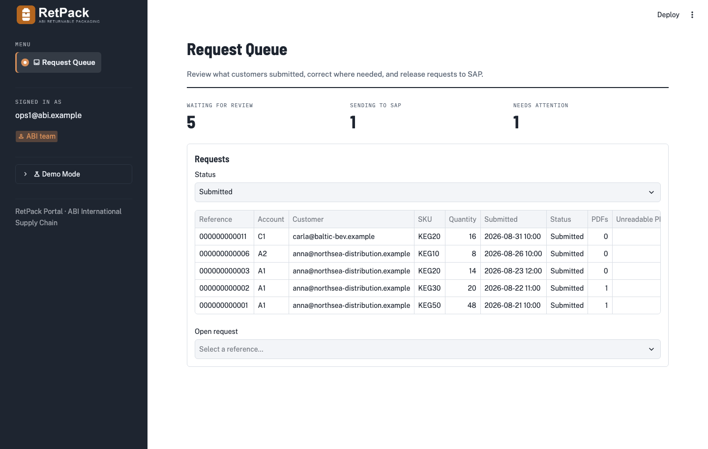

# RetPack Portal (CT POC)



Customer-facing intake portal for returnable packaging (empty keg returns) for ABI International Supply Chain, Europe.
Requirements: [`RETPACK_REQUIREMENTS.md`](RETPACK_REQUIREMENTS.md). Plan and status: [`RETPACK_PLAN.md`](RETPACK_PLAN.md).

Phase A (mock POC) is complete and Phase B (real adapters) is built and awaiting a workspace to run against. All three
screens run locally with no workspace and no credentials on either the `mock` or the persistent `sqlite` backend.

## Quick start

```bash
uv sync --all-extras
make run-mock      # in-memory, reseeded on every start
make run-sqlite    # persistent local database in .retpack/, same SQL code path as the workspace backends
```

Open http://localhost:8501. The sidebar shows a **Demo mode** banner and a **Demo user** switcher (mock backend only; no
other backend exposes it):

| User | Role | Sees |
|---|---|---|
| `anna@northsea-distribution.example` | customer, accounts A1 + A2 | New request, My requests |
| `bram@rhine-logistics.example` | customer, account B1 | New request, My requests |
| `carla@baltic-bev.example` | customer, account C1 | New request, My requests |
| `ops1@abi.example`, `ops2@abi.example` | internal | Request queue |

Demo data lives in `config/mock/` (accounts, SKUs, sales orgs, balances, users) and is seeded with eleven requests
covering every status, including one with an unreadable (scanned) PDF and one dead-lettered CPI call.

## Configuration

| Variable | Default | Purpose |
|---|---|---|
| `RETPACK_SUBMISSION_BACKEND` | `mock` | `mock` \| `sqlite` \| `delta` \| `lakebase`; workspace settings for the last two are in `docs/deploy.md` |
| `RETPACK_FIELD_SPEC` | `config/fields/placeholder.yaml` | Field specification (FR-03). Real spec arrives as `abi_v1.yaml` in Phase C |
| `RETPACK_ATTACHMENT_POLICY` | `config/attachments.yaml` | Document types, cardinality, size limit (FR-04) |
| `RETPACK_MOCK_DATA_DIR` | `config/mock` | Reference data and users for the mock backend |
| `RETPACK_ATTACHMENT_DIR` | `.retpack_attachments` | Local PDF store for the mock backend |
| `RETPACK_MOCK_USER` | unset | Default signed-in email for local runs |
| `RETPACK_MOCK_SEED` | `0` | Seed the demo requests on start (`make run-mock` sets it) |
| `RETPACK_DEMO_IMPERSONATION` | `0` | Workspace backends: let verified ABI-team users view the portal as demo users (dev demo only) |

`.streamlit/config.toml` caps uploads at the same size as the attachment policy, hides exception details from the
browser, and carries the visual theme (colours, fonts, dark sidebar); a test keeps the upload cap in sync. Static CSS
and the status labels live in `src/retpack_ui/theme.py`. The logo files in `assets/` are placeholders generated by
`scripts/make_logo.py`; replace them with the brand files and keep the names.

## Layout

```
src/retpack_core/      domain models, field-spec validation, event fold, ports, services  (no Databricks / Streamlit imports)
src/retpack_adapters/  sql/ (shared repositories + dialects), sqlite/, delta/, lakebase/ executors, attachment stores, identity, factory
src/retpack_ui/        Streamlit entry point, three screens, rendering components, theme (assets/ holds the placeholder logo)
src/retpack_jobs/      maintenance (OPTIMIZE/VACUUM), attachment reaper; CPI dispatch (Phase C)
config/                field spec, attachment policy, mock data
migrations/            delta/, lakebase/ and sqlite/ DDL; apply with `python -m retpack_adapters.migrate_cli <backend>`
tests/                 unit, contract (parametrized over backends), isolation (FR-02 gate), ui (AppTest)
```

## Development

```bash
make check            # ruff, mypy, pytest with coverage gate (80%), bandit, pip-audit
make test             # tests only
make security         # bandit + pip-audit only
make contract-delta   # contract + isolation suites against Delta (needs a workspace; see docs/deploy.md)
make contract-lakebase
```

The isolation suite in `tests/isolation/` is the FR-02 release gate. It runs against every backend the contract suite
knows about (`mock` and `sqlite` always; `delta` and `lakebase` when `RETPACK_TEST_DELTA=1` / `RETPACK_TEST_LAKEBASE=1`
and the workspace settings are present) and includes a static check that no repository method can be called without a
`Principal`.

Data written by the portal is described in `docs/data_contract.md`; deployment steps are in `docs/deploy.md`; the
end-user manual is `docs/USER_MANUAL.md`.

`tests/unit/test_core_purity.py` fails the build if any Databricks, Streamlit or database-driver import creeps into
`retpack_core`.

PDF inspection (page count, text-layer check) runs in a short-lived subprocess with a time and memory budget, so a
hostile file cannot stall the shared app container.
