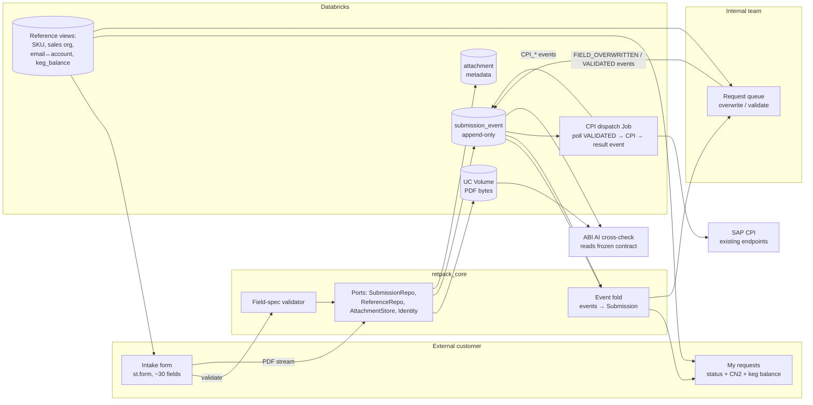

# ABI RetPack Portal — Implementation Plan

Companion to `RETPACK_REQUIREMENTS.md` (derived from *ABI RetPack Portal — Requirements & Development Plan v0.1*, 1 Sep 2026). Plan date: 3 Sep 2026.

Same convention as the requirements: `[ABI]` is fixed by the source and needs ABI sign-off to change; `[CT]` is our decision. Everything in this plan is `[CT]` unless it quotes an `[ABI]` requirement by ID.

---

## 1. Overview

Three Streamlit screens over a pure-Python core, a swappable transactional backend (mock → Delta → Lakebase), PDF attachments streamed to a Unity Catalog Volume, and an asynchronous Databricks Job for the SAP/CPI handoff.

Constraints that shape every step below:

| Constraint | Source | Consequence in this plan |
|---|---|---|
| 2 external + 1 internal screen, no more | NFR-04 `[ABI]` | No admin screen, no drill-down, no settings page. Configuration is YAML + env vars. |
| Tenant isolation is a release gate | FR-02 `[ABI]` | Isolation tests are built in Phase A and fail the CI pipeline from Phase B onward. |
| Portal validates format + mandatory only | FR-06 `[ABI]` | Validation engine has exactly two rule kinds: `required` and per-field format. No cross-field business rules. |
| Never call CPI from the request thread | FR-10 `[CT]` | CPI dispatch is a separate Databricks Job package, not app code. |
| `retpack_core` has zero Databricks imports | 5.1 `[CT]` | Enforced by a unit test, not by convention. |
| Build before external gates open | 6 `[CT]` | Phase A starts now with no ABI input and no workspace. |

Deliverables by phase:

| Phase | Deliverable | Needs from ABI | Gate to exit |
|---|---|---|---|
| A — Mock POC | Three screens running locally on `RETPACK_SUBMISSION_BACKEND=mock`; contract + isolation suites green on mock | Nothing | Demo to ABI; IT-security conversation has a concrete artefact |
| B — Real adapters | Identical app deployed to workspace on Delta; Lakebase adapter passing the same contract suite; frozen data contract handed to the AI team | Inputs 3, 4, 6, 7 (req. §7) | Contract suite green on `[mock, delta, lakebase]`; data contract doc signed |
| C — Real content | Real ~30-field spec; internal role wired; CPI dispatch job live in dev | Inputs 1, 2, 5 | End-to-end submit → validate → CPI call in dev |
| D — Harden | Isolation gate in CI, E2E with AI cross-check, SAP integration test, negative paths, UAT | UAT users, QA ECC | UAT sign-off; release checklist complete |

---

## 2. Data flow



Direction of truth:

- **Source**: reference views (SKU per account, sales orgs, email↔account, keg balance). Read-only from the portal. Owned by the ABI data layer.
- **Target**: `submission_event` and `attachment` tables (Delta in Wave 1) plus PDF bytes in a Volume. Written only through `SubmissionRepository` and `AttachmentStore`.
- **Derived**: current status, current field values, audit trail. Never stored as mutable state; always folded from events.

---

## 3. Target repository layout

```
CT_poc/
├── pyproject.toml                # uv-managed; extras: ui, databricks, lakebase, dev
├── app.yaml                      # Databricks Apps manifest (Phase B)
├── Makefile                      # run-mock, test, lint, typecheck, contract-delta, contract-lakebase
├── config/
│   └── fields/
│       ├── placeholder.yaml      # Phase A — one field of every type
│       └── abi_v1.yaml           # Phase C — real ~30 fields from the mapping Excel
├── src/
│   ├── retpack_core/             # pure Python, no streamlit / databricks / psycopg
│   │   ├── ids.py                # new_id() -> UUIDv7 string
│   │   ├── principal.py          # Principal, Role
│   │   ├── errors.py             # NotFoundError, ConcurrencyConflictError, ValidationFailedError, ...
│   │   ├── models/               # SubmissionEvent, Submission, Status, AttachmentMeta, reference rows
│   │   ├── fieldspec/            # FieldSpec schema, YAML loader, validator
│   │   ├── events.py             # EventType enum, fold(events) -> Submission
│   │   ├── ports/                # SubmissionRepository, ReferenceRepository, AttachmentStore, IdentityProvider (Protocols)
│   │   └── services/             # intake.py, review.py, query.py — the only entry points the UI calls
│   ├── retpack_adapters/
│   │   ├── factory.py            # build_container(env) -> Container of concrete adapters
│   │   ├── mock/                 # in-memory repos seeded from tests/fixtures/*.json, local attachment dir, env-var identity
│   │   ├── delta/                # DeltaSubmissionRepository, DeltaReferenceRepository (databricks-sql-connector)
│   │   ├── lakebase/             # LakebaseSubmissionRepository (psycopg 3)
│   │   ├── attachments/          # LocalAttachmentStore, VolumeAttachmentStore (databricks-sdk Files API)
│   │   └── identity/             # MockIdentity, DatabricksAppsIdentity (forwarded headers)
│   ├── retpack_ui/
│   │   ├── app.py                # entry: resolve principal, route by role
│   │   ├── pages/                # intake.py, my_requests.py, internal_queue.py
│   │   └── components/           # form_renderer.py, attachment_uploader.py, status_badge.py
│   └── retpack_jobs/
│       └── cpi_dispatch/         # Databricks Job: poll → CPI → result event (Phase C)
├── migrations/
│   ├── delta/                    # 001_submission_event.sql, 002_attachment.sql, 003_views.sql, ...
│   └── lakebase/                 # 001_submission_event.sql (sequence + unique constraint), ...
├── tests/
│   ├── unit/                     # core only; runs without any adapter
│   ├── contract/                 # one suite, parametrized over [mock, delta, lakebase]
│   ├── isolation/                # FR-02 release gate; imported by contract suite
│   ├── ui/                       # streamlit AppTest smoke tests against mock backend
│   ├── integration/              # Delta on dev workspace, Volume upload, Apps identity
│   └── fixtures/                 # accounts.json, skus.json, sales_orgs.json, submissions.json, sample.pdf, scanned.pdf
└── docs/
    ├── data_contract.md          # frozen at end of Phase B; versioned
    └── runbook.md                # Phase D
```

File-size and function-size limits from the coding-style rules apply (target 200–400 lines per file, functions under 50 lines). The form renderer and the Delta repository are the two files most likely to breach; split by section / by query group if they do.

---

## 4. Key design decisions

### 4.1 Principal and isolation

```python
@dataclass(frozen=True)
class Principal:
    email: str
    account_ids: frozenset[str]     # payer / sold-to codes; empty for INTERNAL
    role: Role                      # CUSTOMER | INTERNAL
```

- Every method on every port takes `principal: Principal` as its first argument. No defaults, no `Optional`. A method without it fails a static test (§7.3).
- `CUSTOMER` principals are filtered by `account_ids` inside the adapter, in the query itself, never post-filtered in Python.
- `INTERNAL` principals are unfiltered but every read is logged with actor identity.
- Cross-tenant access raises `NotFoundError`, never `Forbidden`, so existence of another tenant's request is not leaked.
- Principal-scoped data is **never** placed in `st.cache_data` or `st.cache_resource` (both are process-global across sessions). Only global reference data (sales orgs) is cached. Per-account SKU lists are 4–5 rows; fetch them uncached.
- Session state is bound to the principal's email; any change of identity within a session purges every key except the demo switcher.

### 4.2 Event model and status derivation

```python
class EventType(StrEnum):
    SUBMITTED = "SUBMITTED"                  # payload: all field values
    ATTACHMENT_ADDED = "ATTACHMENT_ADDED"    # payload: AttachmentMeta
    FIELD_OVERWRITTEN = "FIELD_OVERWRITTEN"  # payload: field, prior, new
    VALIDATED = "VALIDATED"
    CPI_DISPATCHED = "CPI_DISPATCHED"        # payload: idempotency_key, attempt
    CPI_SUCCEEDED = "CPI_SUCCEEDED"          # payload: cpi reference
    CPI_FAILED = "CPI_FAILED"                # payload: error, attempt, terminal: bool
    CREDIT_NOTE_RECORDED = "CREDIT_NOTE_RECORDED"  # CN2 outcome
```

- `fold(events: Sequence[SubmissionEvent]) -> Submission` is a pure function in core. Current field values, status, attachments and audit trail all come from it.
- `Status` is a **placeholder** enum (`SUBMITTED`, `VALIDATED`, `CPI_PENDING`, `CPI_DONE`, `CPI_FAILED`) until input 3 (req. §7) freezes it. It lives in one file; renaming is one commit plus a migration of the derived view.
- `append_event(principal, submission_id, expected_seq, event) -> int` is the only write. It returns the new `seq` or raises `ConcurrencyConflictError`. Callers read state, act, and append with the seq they read. One user action = one append. No `begin`/`commit` on the port.
- `submission_id` is a UUIDv7 string generated in `retpack_core.ids` via the `uuid-utils` package (Python 3.11 has no native uuid7).

### 4.3 Field spec

- Schema is a pydantic v2 model: `name`, `label`, `type` (`string | integer | decimal | date | enum | text`), `section`, `order`, `required`, `pattern`, `max_length`, `min`/`max`, `source` (for `enum`: `static:[...]` or `ref:skus_for_account | ref:sales_orgs | ref:destinations`).
- Loader validates the YAML at startup and fails fast on unknown keys, duplicate names, or a `ref:` source the reference repository does not provide.
- Validator returns `ValidationResult(errors: dict[field, list[str]])`. It is the single source of truth; the UI shows the same messages client-side after `st.form` submit.
- Placeholder spec (Phase A) has one field of every type and every rule kind so the renderer and validator are fully exercised before the real spec arrives.

### 4.4 Attachments

- `AttachmentStore.put(principal, submission_id, *, account_id, doc_type, seq, filename, stream) -> AttachmentMeta` consumes the stream once: requires `%PDF-` at offset 0, hashes SHA-256 while copying to the destination, and never holds the whole file in memory. Streamlit's `UploadedFile` is a `BytesIO` on the app side; the store must stream it out to the Volume rather than re-buffering. Objects live under `<account_id>/<submission_id>/` and the store refuses access outside the principal's accounts.
- `page_count` and `has_text_layer` computed with `pypdf` on the stored file in a sandboxed subprocess (time and memory budget from the policy), checking the first 3 pages only. `has_text_layer=False` renders a warning on the intake page; it never blocks (FR-06). A file that cannot be inspected within budget is rejected as unreadable.
- Duplicate `sha256` within the same submission is rejected; across submissions it is surfaced to the internal queue as an information flag only.
- Doc types and cardinality are config in the same YAML family (`config/attachments.yaml`), placeholder in Phase A, real in Phase C after input 2.
- Size limit: 25 MB per file, enforced server-side. `[CT]` placeholder value pending input 2.

### 4.5 Backend selection

`RETPACK_SUBMISSION_BACKEND=mock|delta|lakebase` read once by `retpack_adapters.factory.build_container()`. The UI receives a `Container` dataclass of concrete adapters and never imports an adapter module directly.

| Backend | Submission repo | Reference repo | Attachment store | Identity |
|---|---|---|---|---|
| `mock` | in-memory from JSON fixtures | fixtures | local temp dir | `RETPACK_MOCK_USER` env var + sidebar user picker |
| `delta` | Delta via SQL warehouse | Delta views | UC Volume | Databricks Apps forwarded headers |
| `lakebase` | Postgres via psycopg 3 | Delta views | UC Volume | Databricks Apps forwarded headers |

Delta `append_event` implementation: `MERGE INTO submission_event ... ON submission_id = ? AND seq = ? WHEN NOT MATCHED THEN INSERT`, then check `num_inserted_rows == 1` from the MERGE result row; zero means a concurrent writer won and `ConcurrencyConflictError` is raised. `ConcurrentAppendException` from Delta itself is retried with bounded exponential backoff (3 attempts) before surfacing.

Lakebase `append_event`: plain `INSERT`; `UniqueViolation` on `(submission_id, seq)` maps to `ConcurrencyConflictError`.

### 4.6 Identity

- Databricks Apps injects `X-Forwarded-Email` / `X-Forwarded-Preferred-Username` on every request; the app reads them from `st.context.headers`. Email → `account_ids` is resolved through `ReferenceRepository.accounts_for_email()` on every request, never cached in session state (FR-01).
- Phase B must verify, not assume, that the Apps proxy overwrites client-supplied `X-Forwarded-*` headers. If it does not, the app must fall back to the SDK's user-identity call.
- Internal role = membership of a workspace group (name TBD, input 6). Mock backend takes role from the fixture user record.

### 4.7 CPI dispatch job

Separate package `retpack_jobs.cpi_dispatch`, deployed as a scheduled Databricks Job (every 5 minutes, one concurrent run max):

1. Query submissions whose folded status is `VALIDATED` with no non-terminal `CPI_*` event after the last `VALIDATED`.
2. For each: append `CPI_DISPATCHED` with `idempotency_key = f"{submission_id}:{validated_seq}"`, call CPI with that key, bounded retry (3 attempts, exponential backoff, 30 s timeout each).
3. Append `CPI_SUCCEEDED` or `CPI_FAILED(terminal=True)` after the last attempt. Terminal failures are the dead letter; they show in the internal queue and raise an alert (Phase D).
4. Restart-safe by construction: the idempotency key is derived from the event log, and CPI is called with the same key on retry.

The CPI contract itself (payload, auth, endpoint) is input 5. Until then the job runs against a stub HTTP endpoint in `tests/fixtures`.

### 4.8 Tooling

| Concern | Choice | Notes |
|---|---|---|
| Python | 3.11 | Databricks Apps runtime |
| Packaging | `uv` + `pyproject.toml`, src layout | extras keep core installable without Databricks deps |
| Models / config | pydantic v2 | field spec, events, attachment meta |
| Lint / format / types | ruff (line 160), mypy strict on `retpack_core` | per coding-style rules |
| Tests | pytest, pytest-cov (≥ 80%), `streamlit.testing.v1.AppTest` | |
| Delta access | `databricks-sql-connector` against a serverless SQL warehouse | app service principal in Phase B; evaluate on-behalf-of user auth for UC row filters |
| Volume access | `databricks-sdk` Files API (`files.upload` with a stream) | |
| Lakebase | `psycopg[binary]` 3, credential from `databricks-sdk` database API, token refresh on expiry | |
| PDF inspection | `pypdf` | page count, text-layer check |
| IDs | `uuid-utils` | UUIDv7 |
| Streamlit | ≥ 1.40 | `st.context.headers`, `st.form` |

---

## 5. Prerequisites

Phase A needs none of these. Everything below gates Phase B or later.

- [ ] Input 1 — ABI mapping Excel + BRD (blocks C1, estimate refinement)
- [ ] Input 2 — Attachment spec: types, cardinality, mandatory, size limit (blocks C2)
- [ ] Input 3 — Status enum (blocks B10 data-contract freeze)
- [ ] Input 4 — Reference view column names / DDL (blocks B3, B1 views)
- [ ] Input 5 — CPI contract: payload, auth, idempotency (blocks C5). Check CT's prior SAP BTP work first.
- [ ] Input 6 — Identity source for email → account, internal group name (blocks B5, C4)
- [ ] Input 7 — Workspace access, PrivateLink status, app service principal, SQL warehouse, Volume path (blocks B2–B9)
- [ ] Decision — Keg balance calculation ownership, ABI or CT (blocks C6; Phase A shows a fixture number)
- [ ] Decision — Retention horizon 3 or 5 years (blocks D6)
- [ ] Dev workspace for CI contract runs against Delta and Lakebase (blocks B7)

---

## 6. Implementation steps

Complexity: **S** ≤ 0.5 day, **M** 1–2 days, **L** 3–5 days. Each step lists the tests written first (TDD).

### Phase A — Mock POC (no ABI input)

**Status (3 Sep 2026): complete.** All fifteen steps below are implemented and reviewed. Gate: 268 tests passing, 64 env-gated skips for the Delta and Lakebase parametrizations, coverage 95%, ruff, mypy, bandit and pip-audit clean, `make run-mock` boots. Deviations from the table: demo data lives in `config/mock/` rather than `tests/fixtures/` so the app and the tests share it; the mock adapters were built in A6 alongside the services (the hand-written fake would have duplicated them). Decisions taken during the A15 review pass are listed under "Review outcomes" after the table.

| # | Step | Cx | Tests first |
|---|---|---|---|
| A1 | Scaffold: `pyproject.toml` with extras, src layout, ruff/mypy/pytest config, Makefile, CI pipeline running lint + type + unit | S | CI green on empty packages |
| A2 | `retpack_core`: `ids`, `Principal`/`Role`, `errors`, `Status` placeholder, `AttachmentMeta`, reference row models | S | `test_ids_are_time_ordered`, `test_principal_is_frozen` |
| A3 | Field spec: pydantic schema, YAML loader with fail-fast, `placeholder.yaml`, validator | M | Loader rejects unknown key / duplicate name / unresolvable `ref:`; validator: required, pattern, max_length, min/max, enum membership, free text passes anything |
| A4 | Events: `EventType`, `SubmissionEvent`, `fold()` | M | Fold of SUBMITTED → status SUBMITTED; FIELD_OVERWRITTEN changes value and keeps prior in audit; VALIDATED → VALIDATED; CPI sequence; empty list → error; out-of-order seq → error |
| A5 | Ports as `typing.Protocol`: `SubmissionRepository`, `ReferenceRepository`, `AttachmentStore`, `IdentityProvider` | S | Static test: every public method's first parameter is `principal: Principal` (§7.3) |
| A6 | Services: `intake.submit()`, `review.overwrite_field()`, `review.validate()`, `query.list_my_requests()`, `query.get_request()`, `query.keg_balance()` | M | Unit tests with a hand-written fake repo; submit with invalid values raises `ValidationFailedError` and appends nothing; overwrite by CUSTOMER raises; validate appends exactly one event |
| A7 | Mock adapters: in-memory submission repo seeded from `tests/fixtures/submissions.json`, fixture reference repo, `LocalAttachmentStore`, `MockIdentity` | M | Contract suite (A8) on mock |
| A8 | Contract suite `tests/contract/test_submission_repository.py` parametrized by backend fixture; only `mock` available in Phase A. Includes isolation cases from `tests/isolation/` | M | append/read round trip; expected_seq conflict raises; list is filtered by principal; get of other tenant's id raises NotFoundError; INTERNAL sees all |
| A9 | Core purity guard: import `retpack_core` in a subprocess, assert none of `streamlit`, `databricks`, `pyspark`, `psycopg` in `sys.modules` | S | the test itself |
| A10 | `retpack_ui/app.py`: build container, resolve principal, route CUSTOMER → intake + my requests, INTERNAL → queue | S | AppTest: mock user with CUSTOMER role sees two pages, INTERNAL sees one |
| A11 | Form renderer from field spec inside `st.form` + attachment uploader (magic bytes, sha256, page count, text-layer warning) + intake page rendering result from the returned `Submission` object, no re-read | L | AppTest: required-field error shown; valid submit shows confirmation with the new id; non-PDF rejected; scanned PDF shows warning and still submits |
| A12 | My requests page: list with status + CN2 outcome, detail view read-only, keg balance as a plain number | S | AppTest: only own requests visible; balance shows fixture value |
| A13 | Internal queue: list all, open one, overwrite any field (prior and new shown), validate action | M | AppTest: overwrite appends FIELD_OVERWRITTEN with actor; validate changes status; stale seq shows conflict message |
| A14 | Demo fixtures (3 accounts, 2 users each, 1 internal user, ~10 submissions in mixed states, one sample and one scanned PDF), `make run-mock`, README quick-start | S | — |
| A15 | Review pass: code-reviewer and security-reviewer agents on the full diff; fix findings | S | — |

Exit: `make test` green with ≥ 80% coverage; `make run-mock` demonstrates all three screens; isolation suite green on mock.

**Review outcomes (A15).** Two independent review passes (code quality, security) produced 23 and 19 findings. All were applied; the ones that changed the design are recorded here so Phase B builds on them:

- **Session state is bound to the principal.** Every rerun re-resolves identity and purges all session keys except the demo switcher when the email changes. Regression test: switching the demo user after a submit renders nothing of the previous user.
- **Attachment storage is account-scoped.** Objects live under `<account_id>/<submission_id>/`, `AttachmentMeta` carries `account_id`, and the store itself refuses reads and writes outside the principal's accounts. This is the second FR-02 layer for attachments; the service check through the repository remains the first. The Volume adapter in Phase B mirrors the path.
- **PDF inspection is sandboxed.** Page count and text-layer detection run in a short-lived subprocess with a wall-clock budget (`inspect_timeout_s`) and an address-space limit; `max_pages` is policy. A 70 KB hostile file measured 193 s and 1.2 GB in-process before this change. `%PDF-` must be at offset 0: HTML and ZIP polyglots are rejected.
- **No wholesale buffering on the download path.** The internal queue prepares one download at a time on an explicit click; at most one file is resident per session. Phase B replaces this with a short-lived presigned Volume URL (B4).
- **Failed submits leave no orphans.** Stored PDFs are deleted if the event append fails. `delete` was added to the `AttachmentStore` port. A reaper for Volume objects without a referencing event is a Phase B step (B12).
- **Account ownership is enforced in the service**, not by the YAML declaring `account_id` as a scoped enum. The event's `account_id` comes from the validated values; the repository additionally rejects any event whose `account_id` differs from the submission's, and `fold` rejects a log that mixes accounts.
- **Dead letters are reviewable.** `CPI_FAILED` (terminal) joins `SUBMITTED` as a status the internal team can correct and re-validate; re-validation clears the CPI error and re-arms dispatch. `VALIDATED`, `CPI_PENDING` and `CPI_DONE` stay read-only. This touches the frozen status enum (input 3) and is recorded against Q3.
- **The owning account cannot be overwritten** through the correction panel or the service; changing ownership would need its own event type.
- **Validator hardening.** Patterns match through the `regex` module with a per-match timeout and require `max_length` (≤ 1024); text without `max_length` is capped at 10,000 characters; numeric strings are length-capped before parsing; decimals are quantised to a per-field `scale` (default 2) so float noise never reaches the event log; every violated rule on a field is reported, not just the first.
- **Corrupt logs are isolated.** A second `SUBMITTED` is rejected on append, and one unreadable log is skipped and logged rather than failing every user's list.
- **Demo identity is structurally mock-only.** The switcher renders only when the container exposes `demo_users`, which only the mock backend populates; a "Demo mode: identity is not verified" banner is always shown with it. Demo seeding is opt-in (`RETPACK_MOCK_SEED=1`, set by `make run-mock`).
- **Streamlit edges.** `.streamlit/config.toml` caps uploads at the policy size and hides exception details; a test keeps the cap in sync with `config/attachments.yaml`. A top-level handler logs unexpected errors with a short reference and shows a generic message.
- **CI.** The isolation and contract suites run as their own required job; a security job runs bandit and pip-audit.

### Phase B — Real adapters (needs inputs 3, 4, 6, 7)

**Status (3 Sep 2026): built, not yet run against a workspace.** Every step below is implemented with the workspace-specific pieces behind small interfaces: the shared SQL repositories run the full contract and isolation suites on SQLite on every commit, and the Delta and Lakebase executors, Volume files client and token identity lookup are unit-tested against fakes. What remains for Phase B exit is purely execution against a workspace once input 7 arrives: apply the migrations, run `RETPACK_TEST_DELTA=1 pytest tests/contract tests/isolation`, deploy the app, and confirm the assumed reference view DDL (input 4). Additions made while building: a fourth backend, `sqlite`, gives a persistent local demo through the same SQL code path (`make run-sqlite`); `docs/data_contract.md` v0.9 and `docs/deploy.md` are written; the asset bundle in `databricks.yml` is unvalidated (validation needs credentials). Presigned download URLs (B4) are not available for Volumes, so the two-step download from Phase A stays.

| # | Step | Cx | Tests first |
|---|---|---|---|
| B1 | `migrations/delta/`: `submission_event`, `attachment`, `submission_current` view (folded status for the job and for UC row filters), `keg_balance` placeholder table; table properties for auto-optimize and retention | M | Migration applies idempotently on a fresh schema (integration) |
| B2 | `DeltaSubmissionRepository`: append via conditional MERGE + bounded retry, principal-filtered reads, `submission_current` for job polling | L | Contract suite on `delta`; conflict test with two writers |
| B3 | `DeltaReferenceRepository` against input-4 views: SKUs per account, sales orgs, accounts for email, keg balance | S | Integration test per view |
| B4 | `VolumeAttachmentStore` via Files API, streaming, path `/Volumes/<catalog>/<schema>/retpack/<account_id>/<submission_id>/<doc_type>_<seq>.pdf`; downloads via short-lived presigned URL and `st.link_button` so bytes never enter the app process | M | Integration: 20 MB upload does not exceed a memory ceiling; sha256 matches; cross-account open is refused by the store |
| B5 | `DatabricksAppsIdentity`: derive the email from verified claims of `X-Forwarded-Access-Token` rather than trusting `X-Forwarded-Email`; confirm the proxy overwrites client-supplied headers | S | Integration: request without a token is rejected; spoofed header is ignored |
| B6 | Lakebase: `migrations/lakebase/` (identity column, unique `(submission_id, seq)`), `LakebaseSubmissionRepository`, credential refresh | M | Contract suite on `lakebase` |
| B7 | CI: contract job runs `[mock, delta, lakebase]` against the dev workspace, env-gated so local runs skip cleanly | M | — |
| B8 | `app.yaml`, resource bindings (warehouse, volume, secrets, optional database), deploy to dev workspace | S | Smoke: deployed app renders intake for a test identity |
| B9 | UC row filters on `submission_event` / `submission_current` keyed on `current_user()` ↔ account mapping, applied only if the app queries as the user; documented as defence-in-depth, not the primary control | S | Integration: user A cannot read B's rows through a raw SQL warehouse query |
| B10 | Freeze `docs/data_contract.md` v1: event table DDL, event payload schemas, `Status` enum (input 3), attachment linkage, reference view names, balance table. Hand to the ABI AI team | S | — |
| B11 | Scheduled `OPTIMIZE` / `VACUUM` job for Delta tables | S | — |
| B12 | Reaper job: delete Volume objects with no referencing `SUBMITTED` / `ATTACHMENT_ADDED` payload older than N hours (orphans from failed appends) | S | Unit with stub listing |
| B13 | Structured audit logging of authorization decisions (unprovisioned logins, cross-tenant `NotFoundError`, rejected attachments, role denials) without field values; wire to workspace logs | S | Log assertions in isolation suite |

Exit: contract suite green on all three backends; app on dev workspace; data contract v1 signed off.

**Verification status per step:** B1 migrations render and split cleanly for both engines, SQLite variant applied in tests; B2/B3/B6 shared `SqlSubmissionRepository`, `SqlReferenceRepository` and `SqlAccountDirectory` pass contract + isolation on SQLite, Delta MERGE result handling and concurrent-retry and Postgres placeholder translation and reconnect are unit-tested with fakes; B4 `VolumeAttachmentStore` passes the store scope tests via an in-memory files client; B5 `DatabricksAppsIdentityProvider` resolves identity from the forwarded access token via `current_user.me()` and ignores the email header unless explicitly trusted; B7 CI job `contract-workspace` is gated on a repository variable; B8 `app.yaml` and bundle written; B9 row-filter function and `ALTER TABLE ... SET ROW FILTER` in `migrations/delta/003_row_filters.sql`; B10 `docs/data_contract.md` v0.9; B11 `retpack_jobs.maintenance`; B12 `retpack_jobs.reaper` unit-tested; B13 `retpack_core.audit` JSON lines wired into intake, review, query and identity.

### Phase C — Real content (needs inputs 1, 2, 5)

| # | Step | Cx | Tests first |
|---|---|---|---|
| C1 | Translate mapping Excel → `config/fields/abi_v1.yaml` (~30 fields, sections, dropdown sources). Any rule missing from the mapping defaults to free text and is listed in a "rules assumed" table for ABI review | M | Loader accepts the spec; one validator test per field with a defined rule |
| C2 | `config/attachments.yaml` from input 2: doc types, cardinality, mandatory, size limit | S | Cardinality rules in the contract suite |
| C3 | Replace placeholder `Status` with the frozen enum; migrate `submission_current` view | S | Fold tests updated |
| C4 | Internal role from workspace group (input 6); remove mock role selection from non-mock backends | S | Integration: group member routes to queue, non-member to intake |
| C5 | `retpack_jobs.cpi_dispatch`: poll, idempotency key, bounded retry, dead-letter event, Job definition, run-once locking | L | Unit with stub CPI: success, transient then success, terminal failure; restart after crash mid-batch does not double-dispatch |
| C6 | Wire keg balance to the real table once ownership is decided | S | Integration |

Exit: submit → internal validate → CPI dev endpoint called once with the correct payload; real field spec live.

### Phase D — Harden

| # | Step | Cx | Tests first |
|---|---|---|---|
| D1 | Isolation suite promoted to a required CI check on every backend; release checklist references the run | S | — |
| D2 | E2E with the ABI AI cross-check reading the frozen contract and Volume | M | Scripted scenario per doc type |
| D3 | SAP integration test on existing triggers in QA ECC | M | Return order created; idempotent on re-run |
| D4 | Negative paths: oversized PDF, non-PDF, duplicate PDF, concurrent overwrite by two internal users, CPI timeout, warehouse cold start under a 30 s UI timeout, missing reference rows for an account | M | One test per path |
| D5 | UAT with 2–3 distributors and the internal team; triage and fix | M | — |
| D6 | Operations: retention policy applied (3 or 5 years), dead-letter alerting, `docs/runbook.md`, cost check against the ≈ $5K/yr target | S | — |

Exit: UAT sign-off; IT-security clearance for external publication; runbook accepted.

---

## 7. Testing strategy

### 7.1 Layers

| Layer | Location | Runs where | Backend |
|---|---|---|---|
| Unit | `tests/unit/` | every commit, local + CI | none (core only, hand-written fakes) |
| Contract | `tests/contract/` | every commit on mock; nightly and pre-release on delta + lakebase | parametrized |
| Isolation | `tests/isolation/` | included in contract; required check from Phase B | parametrized |
| UI smoke | `tests/ui/` | every commit | mock via `AppTest` |
| Integration | `tests/integration/` | nightly, pre-release; env-gated | dev workspace |
| E2E | scripted, Phase D | pre-release | dev / QA |

### 7.2 Contract suite shape

```python
@pytest.fixture(params=["mock", "delta", "lakebase"])
def submission_repo(request) -> SubmissionRepository:
    if request.param != "mock" and not os.environ.get(f"RETPACK_TEST_{request.param.upper()}"):
        pytest.skip(f"{request.param} not configured")
    return build_repo(request.param, isolated_schema=True)
```

Every test creates its own submissions under unique ids so runs on a shared dev schema do not collide.

### 7.3 Isolation cases (FR-02 gate)

- Static: AST scan of `retpack_core.ports` asserts every public method's first parameter is named `principal` and annotated `Principal`. Adding an unfiltered method fails the build.
- Behavioural, per backend: customer A lists → only A's rows; A gets B's id → `NotFoundError`; A appends to B's submission → `NotFoundError`; A with two accounts sees both; INTERNAL sees all; a principal with no accounts sees nothing.
- UI: `AppTest` with user A confirms B's ids never appear in rendered output.
- Cache audit: grep-based test that no function decorated with `st.cache_data` / `st.cache_resource` takes a `Principal` or account id.

### 7.4 Coverage

80% minimum on `src/` enforced by `pytest --cov-fail-under=80`. `retpack_core` should sit well above that; the adapter packages are where real coverage comes from the contract suite, so a local run with only mock configured will under-report the Delta and Lakebase modules. CI reports the nightly run as the number of record.

---

## 8. Risks and mitigations

| # | Risk | Likelihood | Impact | Mitigation |
|---|---|---|---|---|
| R1 | IT security refuses external identities in Databricks Apps (NFR-01) | Medium | High | Layering in §3: fallback is FastAPI in front of the same core. Phase A gives security a concrete demo early. Decision requested before Phase B ends. |
| R2 | Mapping Excel arrives late or changes after C1 | High | Medium | Fields are YAML (FR-03). Placeholder spec exercises every type in Phase A. Late changes are config commits. |
| R3 | SQL warehouse cold start makes the UI feel broken | Medium | Medium | Serverless warehouse with auto-stop tuned to working hours; no read-after-write; global reference data cached; 30 s query timeout with a clear message. Lakebase path stays tested as the escape hatch. |
| R4 | Concurrent overwrite by two internal users | Low | Medium | `expected_seq`; the loser sees "request changed, reload". Tested in B2 and D4. |
| R5 | CPI timeout blocks the single app process | Medium | High | CPI is never called from the app (§4.7). Job has its own timeouts. |
| R6 | Status enum drifts between portal and AI team | Medium | High | Frozen in B10 as a versioned document; enum lives in one file; AI team builds only against the signed version. |
| R7 | Scanned PDFs give the AI cross-check nothing | High | Low | `has_text_layer` warning at upload; flag visible in the internal queue. |
| R8 | Forwarded identity headers can be spoofed | Low | Critical | Verified explicitly in B5; fall back to SDK identity call if the proxy does not overwrite client headers. |
| R9 | Cost creep beyond ≈ $5K/yr | Medium | Medium | Smallest app compute, serverless warehouse auto-stop, no extra screens, D6 cost check before go-live. |
| R10 | Delta per-row insert churn degrades reads | Low | Low | Auto-optimize table properties and the scheduled OPTIMIZE job (B11). Volumes are tiny at this scale. |
| R11 | Approvals dominate elapsed time (source estimate ≈ 90%) | High | Medium | Phase A needs nothing external. Phases B–D are ordered so each waits on the fewest inputs. |
| R12 | Scale-out to China/Korea/Vietnam requested on this stack | Low | High | Out of scope; documented as requiring a re-architecture line item (req. §5.4). |

---

## 9. Open questions mapped to steps

The questions document referenced by the requirements is not in this repository. Cross-references below use its numbering where the requirements cite it.

| Question | Blocks | Default assumed until answered |
|---|---|---|
| Q1 — Customer email provisioning process | B5, C4 | Manual SCIM provisioning by ABI admins; portal only reads |
| Q2 — Attachment types, cardinality, mandatory | C2 | One optional `delivery_note` PDF, 25 MB limit |
| Q3 — Status enum | B10, C3 | Placeholder in §4.2. Phase A decision to confirm with ABI: a terminal `CPI_FAILED` request may be corrected and re-validated by the internal team |
| Q6 — Keg balance calculation ownership | C6 | ABI provides a `keg_balance(account_id, balance, as_of)` view; portal reads it |
| Reference view DDL (input 4) | B1, B3 | Column names guessed in fixtures, isolated behind `ReferenceRepository` |
| CPI contract (input 5) | C5 | Stub endpoint; check CT's prior SAP BTP deliverables first |
| Retention 3 vs 5 years | D6 | 5 years (the conservative choice; shortening is easier than recovering) |
| Row filters: does the app query as the user or as a service principal? | B9 | Service principal; row filters documented as optional defence-in-depth |

---

## 10. Definition of done

Per step: tests written first and passing, `ruff format`, `ruff check`, `mypy` clean, type hints and Google docstrings on public functions, no secrets in code, coverage not reduced.

Per phase: the exit criteria in §6, a review pass by the code-reviewer and security-reviewer agents, README and `docs/` updated for anything a new engineer would need to run the phase's deliverable.

---

## 11. Indicative effort

Build effort only; calendar time is dominated by approvals and inputs per the source estimate.

| Phase | Build effort | Firmness |
|---|---|---|
| A | 10–14 engineer-days | Firm: no external dependencies |
| B | 8–12 engineer-days | Indicative: depends on workspace access and view DDL |
| C | 6–10 engineer-days | Indicative: C1 scales with mapping quality; C5 with CPI contract clarity |
| D | 6–10 engineer-days plus UAT calendar | Indicative |

Refine B–D once inputs 1, 4 and 5 are in hand.
