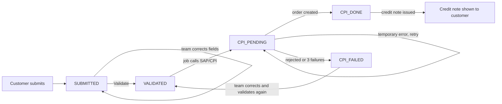

# RetPack Portal — User Manual

Version 0.2 (Phase A/B build with the first design pass, 3 Sep 2026). The screens described here run on placeholder fields and demo data; the real field list, document types and status names arrive from ABI later and will change labels, not the flow.

---

## 1. What the portal is

RetPack is the place where a distributor tells ABI: *"we are sending empty kegs back, here are the details, here is the paperwork."*

- A **customer** (one of ~50 distributors in Europe) fills in one form per return shipment, attaches the delivery note as a PDF, and submits it.
- The **ABI internal team** (3 people) sees every submitted request in a queue, corrects anything that is wrong, and presses **Validate**. That releases the request to SAP, where a return order is created automatically.
- The customer can follow the request afterwards: whether it has been validated, and the credit-note outcome once it exists.

The portal deliberately does **not** judge whether a request is commercially correct. It checks that mandatory fields are filled and that formats are right (for example, a container number has ten digits). Business correctness is the internal team's job, helped by ABI's existing AI cross-check that reads the attached PDFs.

There are exactly three screens: two for customers, one for the internal team. The menu in the dark sidebar on the left switches between them; below the menu you see who you are signed in as and your role.

---

## 2. Who sees what

| Role | How you get it | Screens |
|---|---|---|
| Customer | Your sign-in email is mapped to one or more customer accounts (payer / sold-to numbers) | **New Request**, **My Requests** |
| Internal (ABI team) | Your email is on the internal-user list | **Request Queue** |

You never choose your role and never type your email into the portal. Identity comes from the platform sign-in, on every page load. A customer only ever sees their own accounts' requests; there is no way to look up another distributor's data, and requests that are not yours behave exactly as if they did not exist.

If your email is not mapped to anything you see: *"Your account is not provisioned for the RetPack portal. Contact your ABI representative."* That is expected for new users until ABI adds the mapping.

### Demo mode

The sidebar has a **Demo Mode** panel with a **View as** drop-down in two situations:

- **Local runs** (`make run-mock`, `make run-sqlite`): anyone can pick any demo user; identity is not verified at all.
- **The deployed demo**: you sign in with your real account as usual. If that account is on the ABI internal list, the panel appears and you can view the portal as any demo customer or team member to see both sides. The sidebar then shows *Viewing as* the demo user and *Signed in as* you. Customers never get this panel, and every switch is written to the audit log. The option is switched on only for the dev deployment. The demo users are:

| Demo user | Role | Accounts |
|---|---|---|
| anna@northsea-distribution.example | Customer | A1, A2 |
| bram@rhine-logistics.example | Customer | B1 |
| carla@baltic-bev.example | Customer | C1 |
| ops1@abi.example, ops2@abi.example | Internal | all |

The demo set contains eleven requests in every possible state, including one with an unreadable (scanned) PDF and one that SAP rejected.

---

## 3. Customer: New Request

Sidebar → **New Request**.

### Step 1 — pick the account

In the **Customer Account** card at the top, choose the **Account** the return belongs to. If your email is mapped to several accounts you will see them all here. The SKU list further down depends on this choice, so it comes first and sits outside the form.

### Step 2 — fill in the form

The form is grouped into cards, one per section, two fields per row. In the current placeholder version:

| Section | Fields | Rules |
|---|---|---|
| Account | SKU, Sales organisation | SKU is mandatory and limited to the 4–5 packaging types of the chosen account. Sales organisation is optional; the ABI team fills it if you leave it blank. |
| Shipment | Container number, Seal number, Bill of lading number, Destination, Pickup date | Container number: exactly 10 digits. Bill of lading and pickup date are mandatory. Destination is a fixed list. |
| Quantities | Quantity (kegs), Gross weight (t) | Quantity is mandatory, 1–10 000. Weight is optional, two decimals. |
| Notes | Remarks | Free text, up to 2 000 characters. |

Mandatory fields are marked with **\***. Drop-downs show *Select…* until you choose.

### Step 3 — attach documents

Below the fields, one upload box per document type:

- **Delivery note** — one PDF.
- **Other supporting document** — up to three PDFs.

Rules: PDF only (the portal checks the file content, not just the name), at most 25 MB each, no duplicate files. A **scanned** PDF (a photo or scan with no selectable text) is accepted, but you will get a warning after submitting: the automated cross-check cannot read it, so the request will take the manual route.

### Step 4 — submit

Press **Submit Request**.

- If something is wrong you get a red box *"Please correct the following and submit again"* with one line per problem, for example *Container number: must match ^\d{10}$*. Nothing is saved. Fix the fields and submit again; your other entries are kept.
- If everything is accepted you get a **Request Submitted** card with the **reference** (the last 12 characters of the request id, for example `4C1FDB8E7D32`), a green confirmation, any PDF warnings, and read-only cards with what you sent and the documents.

From this moment the request is with the ABI team. You cannot edit it yourself; if you notice a mistake, contact ABI and they will correct it in the queue.

Press **Start Another Request** to clear the form.

---

## 4. Customer: My Requests

Sidebar → **My Requests**.

### Keg balance

At the top, one number per account: the kegs ABI has shipped to you minus the kegs you have returned, as calculated by ABI. Hover the number to see shipped / returned / as-of date. There is no drill-down by design; for detail, ask your ABI contact.

### Request list

A table of all your requests, newest first:

| Column | Meaning |
|---|---|
| Reference | Short id, the same one shown at submission |
| Account, SKU, Quantity | From your form |
| Submitted | Date and time (UTC) |
| Status | **Not validated** — waiting for the ABI team. **Validated** — released to SAP. |
| Credit note | Number of the credit note once ABI has issued it |

Customers only ever see these two statuses. Whatever happens between "validated" and the credit note (SAP order numbers, shipment numbers, retries) is internal.

### Open a request

Pick a reference in **Open request** to see the full read-only detail: a status badge, the credit-note line, and two tabs, **Details** (current values, including any corrections the ABI team made) and **Documents** (page count and whether the text was readable).

---

## 5. Internal team: Request Queue

Sidebar → **Request Queue**. This is the only internal screen. Three tiles at the top show how many requests are waiting for review, being sent to SAP, and needing attention.

### The list

The **Status** filter defaults to **Submitted**, which is your work queue: everything customers have sent and nobody has validated yet. Statuses are shown with these labels (the technical codes in brackets appear in logs and in the data contract):

| Status | Meaning |
|---|---|
| Submitted (SUBMITTED) | Waiting for review |
| Validated (VALIDATED) | Released; the SAP job will pick it up within minutes |
| Sending to SAP (CPI_PENDING) | Being sent to SAP, or a temporary SAP error is being retried |
| SAP order created (CPI_DONE) | SAP return order created |
| Needs attention (CPI_FAILED) | SAP rejected it or retries ran out — needs a human (see below) |
| All | Everything |

The table shows reference, account, customer email, SKU, quantity, submission time, status, number of PDFs and how many of those are unreadable scans.

### Open a request

Pick a reference in **Open request**. A card opens with the reference, account, customer, submission time and **version** number in its header, a status badge, and any outcome messages (credit note, SAP return-order number, or the SAP error). Below are tabs:

1. **Details**: the values table with four columns: field, current value, original customer value, and a *Yes* marker where they differ.
2. **Documents**: filename, type, pages, size, readable text yes/no; per document **Prepare** and then **Download**. Downloads are two clicks on purpose; only one file at a time is held in memory on the shared server.
3. **Corrections**: who changed which field from what to what, and when. This log is permanent.
4. **Actions** (only while the request can still be edited): correct a field, validate.

### Correct a field

In the **Actions** tab under **Correct a field**: choose the field, enter the new value (the right kind of widget appears: text, number, date, drop-down), press **Save Correction**.

- The same format rules apply as for the customer, so you cannot save a nine-digit container number either.
- The customer's original value is never lost; it stays in the original column and in the change log.
- The **Account** field cannot be changed here. If a request landed on the wrong account, it has to be resubmitted.
- Blank the value to clear an optional field.

### Validate

Press **Validate and Release to SAP**. The portal re-checks all mandatory fields on the current values first. If a mandatory field is still empty the validation is refused and the reason is shown; fill it in and try again.

After a successful validation the status filter switches to **All** so the request stays on screen with its new status. The SAP handoff job runs every few minutes and moves the status to *Sending to SAP* and then *SAP order created* or *Needs attention*.

### "This request was changed by someone else"

Two team members can work in the queue at the same time. Every action you take is checked against the **version** you saw when you opened the request. If a colleague changed it in between, your action is refused with this message and the screen shows the latest version. Read it and repeat your action if it is still needed. Nothing is ever silently overwritten.

### Dead letters (CPI_FAILED)

Filter on **Needs attention** to see requests SAP rejected (for example *CPI 400 unknown sold-to*) or that failed three times on temporary errors. These are the only requests, besides SUBMITTED ones, that you can still edit: correct the offending field and press **Validate** again. The job will retry with a fresh idempotency key, so SAP will not create a duplicate order.

---

## 6. Life of a request

What the customer sees: SUBMITTED = *Not validated*; everything from VALIDATED onward = *Validated*; plus the credit-note number when it exists.

---

## 7. What happens behind the scenes

- **Nothing is ever overwritten.** Every action is a new entry in an append-only log: the submission with its original values, each correction with old and new value and who made it, the validation, every SAP attempt and its result, the credit note. The screens are calculated from that log. This is also the audit trail ABI needs.
- **Documents** are stored as-is in a Databricks Volume, in a folder per account and request. The portal reads only two cheap facts from them, page count and whether there is selectable text, and hands them untouched to ABI's AI cross-check.
- **SAP** is never called while you wait. Validation only marks the request; a background job picks it up, calls the existing CPI endpoint, retries temporary failures up to three times, and records the outcome.
- **Access checks** happen on every request in two independent places: in the database queries (a customer's query can only ever return their own accounts' rows) and in the document store (a file can only be opened for an account the signed-in user belongs to).

---

## 8. Rules and limits at a glance

| Topic | Rule |
|---|---|
| Sign-in | Platform identity; email must be mapped by ABI |
| Editing after submit | Customers: never. Team: while Submitted or Needs attention |
| Mandatory fields | Enforced at submit and again at validate |
| Formats | Per field (digits, dates, drop-down membership); everything else is free text |
| Documents | PDF only, checked by content; 25 MB per file; 1 delivery note + up to 3 others; no duplicates |
| Scanned PDFs | Accepted with a warning |
| Statuses shown to customers | Not validated / Validated, plus credit note |
| Concurrency | Version check; conflicting actions are refused, never merged |

---

## 9. Running it

| Where | How |
|---|---|
| Deployed dev app | https://retpack-portal-1283361390446220.0.azure.databricksapps.com (sign in with your Databricks account; your email must be on the internal list or mapped to an account) |
| Locally, in-memory demo | `make run-mock` then http://localhost:8501; data resets on every start |
| Locally, persistent demo | `make run-sqlite`; data survives restarts in `.retpack/` |

Local runs always show the demo user switcher.

---

## 10. Troubleshooting

| You see | Why | What to do |
|---|---|---|
| *Your account is not provisioned* | Your email is not mapped to an account or the internal list | Ask ABI to add it (production) or pick a demo user (local) |
| *Please correct the following…* | A field broke a rule; nothing was saved | Fix the listed fields, submit again |
| *Request not accepted: not a PDF* / *unreadable PDF* | The file is not a real PDF or is damaged | Export it again as PDF and retry |
| *… has no text layer* (yellow) | Scanned PDF; request is saved | Nothing required; the ABI team will handle it manually |
| *This request was changed by someone else* | A colleague acted on it first | Review the latest version, repeat if still needed |
| *request is CPI_PENDING; only …* | You tried to edit a request that is with SAP | Wait for *SAP order created* or *Needs attention* |
| *Something went wrong … reference XXXXXXXX* | Unexpected error; details are in the server log under that reference | Retry; report the reference if it persists |

---

## 11. Glossary

| Term | Meaning |
|---|---|
| Account / payer / sold-to | The customer number in SAP a return belongs to |
| SKU | Packaging type (50 L keg, 30 L keg, pallet, …) |
| Reference | Last 12 characters of the request id, shown everywhere |
| Version | Number of entries in the request's log; used for the conflict check |
| Validate | The team's release action; triggers the SAP return order |
| CPI | SAP Cloud Integration, the existing endpoint that creates return orders |
| Dead letter | A request SAP rejected or that failed repeatedly; needs a person |
| Credit note (CN2) | ABI's financial outcome for a completed return |

---

## 12. What will change

- **Fields**: the real ~30 fields from the ABI mapping file replace the placeholder set. Sections, labels and rules are configuration, so the screens stay the same.
- **Document types**: the real list and how many of each.
- **Status names**: ABI's official enum replaces the placeholder names; customers still see only validated / not validated.
- **Look and feel**: the first design pass is in (dark menu sidebar, copper accent, cards, status badges). The logo in `assets/` is a placeholder for the real brand files.
